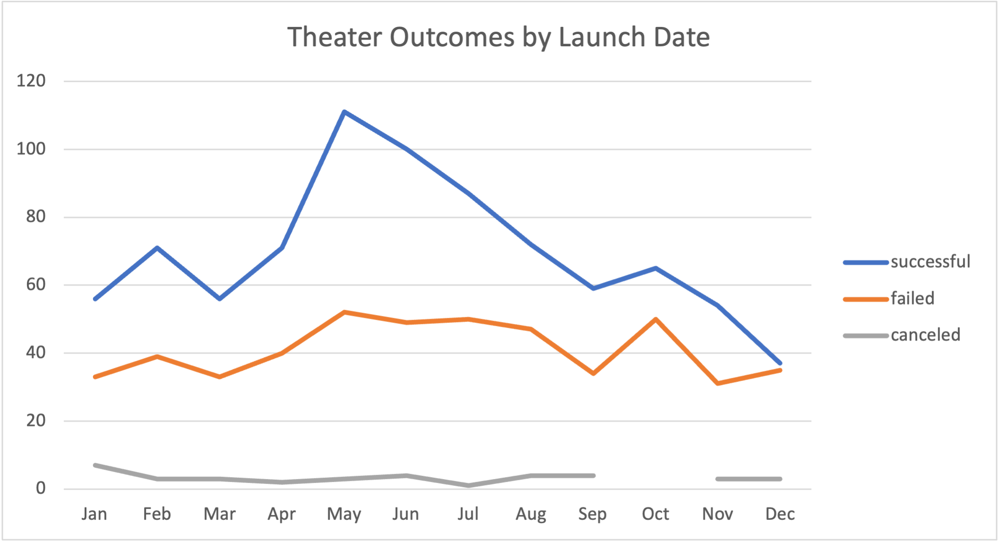
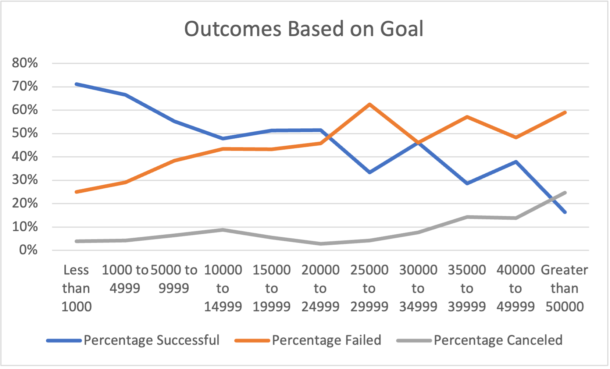

# Kickstarting with Excel

## Overview of Project

This project analyzes outcomes of existing Kickstarter campaigns to identify what metrics correlate with successful fundraising. 

### Purpose

The client is interested in opening a new play in a US Theater, so the purpose of this project is to evaluate previous Kickstarter campaigns to determine what fundraising goals and traits are most likely to lead to raising sufficient funds. 

## Analysis and Challenges

### Analysis of Outcomes Based on Launch Date

I used a pivot table to compare total each campaign outcome against the month of campaign launch date. This was filtered to view only the successful, failed, and canceled results. This table was then made into a line chart to show the changes in each outcome over time:

### Analysis of Outcomes Based on Goals

Next, I created a table that segmented campaign outcomes into segments based on fundraising goal amounts. These totals were found using the COUNTIFS formula to count the number of outcomes that met the goal range and the outcome segment (successful, failed, and canceled). Each of these segments were summed to find the total of projecets for each of the segments as well. The number of outcomes was then divided by the total projects for each goal segment to find the percentage of successful, failed, and canceled outcomes in the table. 

The table was then plotted on a line chart to demonstrate how the success rates change (y-axis) as the fundraising goal increases (x-axis): 

### Challenges and Difficulties Encountered

## Results

